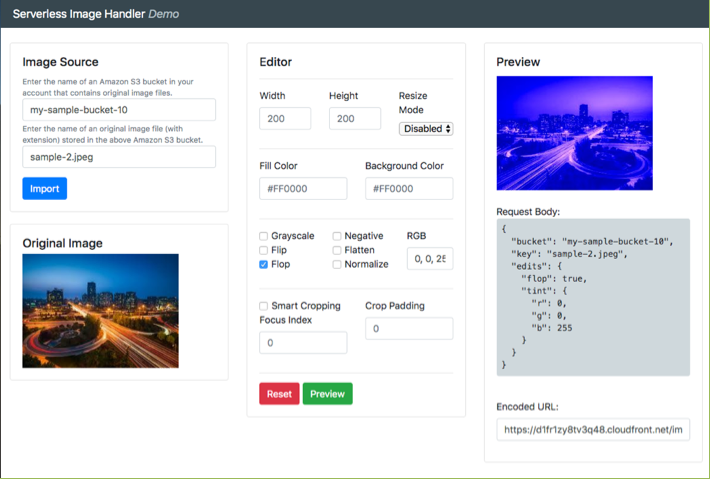

# 无服务器图像处理解决方案部署手册

[English](./AWS_CN_EN.md)

该手册仅适用于在由**西云数据运行的AWS(宁夏)区域**和由**光环新网运行的AWS(北京)区域**部署无服务器图像处理解决方案. 如您希望在 AWS 其他区域
部署该解决方案, 请[访问此链接](https://aws.amazon.com/solutions/implementations/serverless-image-handler/).

## 架构图


* Lambda 中读取 Amazon Simple Storage Service（Amazon S3）中存储的图像，并使用 [Sharp](https://github.com/lovell/sharp) 
对图像进行处理.
* API Gateway 用于接收来自 CloudFront 的 HTTP 请求，并触发 Lambda.
* CloudFront 用于接收来自客户端的请求, 回源到 API Gateway. 对于已经处理过的图像请求，CloudFront 会缓存到 CDN 节点上，减少回源次数。

## 前提条件

* **创建或指定一个或者多个用于图像存储的 Amazon S3 存储桶.** 在启动解决方案的 AWS CloudFormation 
模板之前, 您必须在 SourceBuckets 模板参数中指定一个或者多个 Amazon S3 存储桶, 存储桶用于存储要处理的图像. 存储桶必须与即将启动的 
AWS CloudFormation 堆栈位于**同一区域**.
* **准备 ICP 备案过的域名.** 请准备一个或者两个经过 ICP 备案的域名, 一个用于部署无服务器图像处理程序, 另外一个用于部署演示程序(可选). 我们强烈
建议您在首次部署解决方案以测试解决方案的功能时，部署可选的演示用户界面。
* **(可选)上传 SSL 证书到 AWS Identity and Access Management（IAM).** 我们强烈建议您在生产环境中启用 SSL，如需启用 SSL, 请提前使用
[AWS CLI](https://aws.amazon.com/cli/) 的 [`aws iam upload-server-certificate`](https://docs.aws.amazon.com/cli/latest/reference/iam/upload-server-certificate.html)命令将 SSL 证书上传到 IAM 中。如果您选择启用 SSL，并且使用DemoUI, 请务必为两个域名皆配置证书。
* **配置 DNS 解析.** CloudFormation 堆栈部署完成后，您需要配置 CNAME 解析将域名指向 CloudFront, 并且等待解析生效后方可使用该解决方案。您
可以通过查看 CloudFormation 的输出来获取 CloudFront 的地址。

## 步骤 1. 启动 CloudFormation 堆栈

此自动化AWS CloudFormation 模板在 AWS Cloud 上部署无服务器图像处理程序。

您负责运行此解决方案时使用的AWS服务的成本。 有关更多详细信息，请参见“费用”部分。 有关完整详细信息，请参阅此解决方案中将使用的每个AWS服务的定价页面。

1. 登录到AWS管理控制台，然后单击下面的按钮以启动无服务器图像处理程序 AWS CloudFormation 模板。

    [](https://cn-northwest-1.console.amazonaws.cn/cloudformation/home?region=cn-northwest-1#/stacks/create/template?stackName=ServerlessImageHandler&templateURL=https:%2F%2Faws-solutions-reference.s3.cn-north-1.amazonaws.com.cn%2Fserverless-image-handler%2Flatest%2Fserverless-image-handler.template)
    
1. 默认情况下，该模板在 AWS 宁夏区域启动。 要在其他AWS区域中启动无服务器图像处理程序，请使用控制台导航栏中的区域选择器。

1. 在**创建堆栈**页面上，确认 **Amazon S3 URL** 文本框中显示正确的模板URL，然后选择**下一步**。

1. 在**指定堆栈详细信息**页面上，为解决方案堆栈分配名称。

1. 在**参数**下，查看模板的参数并根据需要进行修改。 此解决方案使用以下默认值。
    
    **API Configuration**
    
    | 参数               | 默认       | 描述                                                         |
    | ------------------ | ---------- | ------------------------------------------------------------ |
    | ApiDomain          | 需要输入   | 访问该服务的域名，必须是 ICP 备案过的域名 |
    | ApiCertificateId  | 需要输入(可选)          | SSL 证书ID, 需提前上传到 IAM, 如不输入，则不启用 HTTPS 访问  |
        
    **CORS Options**
    
    | 参数               | 默认       | 描述                                                                                                                                                                                                         |
    |--------------------|------------|--------------------------------------------------------------------------------------------------------------------------------------------------------------------------------------------------------------|
    | CorsEnabled        | Yes         | 选择是否启用跨域资源共享（CORS）。如果您希望部署 Demo UI, 请选择 Yes。                                                                                                                                       |
    | CorsOrigin         | *          | 该值将由API在Access-Control-Allow-Origin标头中返回。 星号（*）可以支持任何原点。 我们建议您指定一个特定来源（例如`http://example.domain`),以限制跨站点访问您的API。如果CorsEnabled参数设置为No，则忽略此值。 |

    **Image Sources**
    
    | 参数               | 默认       | 描述                                                                                                                                                                                                         |
    |-------------------|------------|--------------------------------------------------------------------------------------------------------------------------------------------------------------------------------------------------------------|
    | SourceBuckets     | 需要输入    | 您帐户中的一个或多个S3存储桶，其中包含您将要操作的图像。 如果提供多个存储桶，请用逗号分隔。请确保选择的S3存储桶和这个解决方案位于同一个AWS区域。|

    **Demo UI**
    
    | 参数               | 默认       | 描述                                                                                                                                                                                                         |
    |-------------------|------------|--------------|
    | DeployDemoUI     | Yes         | 将部署到Demo S3存储桶的 Demo UI |
    | DemoUIDomain     | 需要输入         | Demo UI 所使用的域名，必须是 ICP 备案过的域名|
    | DemoUICertificateId     | 需要输入(可选)         | SSL 证书ID, 需提前上传到 IAM, 如不输入，则不启用 HTTPS 访问 |
    
    **Event Logging**
    
    | 参数               | 默认       | 描述                                                                                                                                                                                                         |
    |-------------------|------------|--------------------------------------------|
    | LogRetentionPeriod| 1          | 将Lambda日志数据保留在CloudWatch日志中的天数 |    
    
1. 选择**下一步**。
  
1. 在**配置堆栈选项**页面上，选择“下一步”。

1. 在**审核**页面上，查看并确认设置。 确保选中确认模板将创建 AWS Identity and Access Management（IAM）资源的框。

1. 选择**创建堆栈**以部署堆栈。

您可以在AWS CloudFormation控制台的**状态**列中查看堆栈的状态。 您应该在大约30分钟内看到状态为 CREATE_COMPLETE。

## 步骤 2. 配置 DNS 解析

1. 点击创建完毕的 CloudFormation 堆栈，选择**输出**

1. 找到 **ApiEndpointCNAME** 和 **DemoUrlCNAME**, 

1. 在您的 DNS 解析服务器配置 CNAME 记录，并指向 CloudFront 分配的默认域名。


## 步骤 3. 创建和使用图像请求

该解决方案生成一个 CloudFront 站点，使您可以通过图像处理程序API访问原始图像和修改后的图像。您为 Image Handler Distribution 配置的 CNAME 域名即为该方案的访问地址，我们称之为 **ApiEndpoint**。 图像的位置和要进行的编辑等参数是在前端的JSON对象中指定的。

例如，以下代码块将图像位置指定为myImageBucket，并指定灰度编辑：true可以将图像更改为灰度。

```javascript
const imageRequest = JSON.stringify({
    bucket: “myImageBucket”
    key: “myImage.jpg”,
    edits: {
        grayscale: true
    }
});
const url = `${CloudFrontUrl}/${btoa(imageRequest)}`;

// Alternatively, you can call the url directly in an  element, similar to:

```

1. 在代码沙箱或您的前端应用程序中，创建一个新的JSON对象。该对象将包含成功检索图像并对其进行编辑所需的键值对。

2. 使用上面的代码示例和Sharp文档，调整以下属性以满足您的图像编辑要求。
    * **Bucket** - 指定包含原始图像文件的Amazon S3存储桶。这是**SourceBuckets**模板参数中指定的名称。您可以通过将图像位置添加到图像处理程序AWS Lambda函数的SOURCE_BUCKETS环境变量中来更新图像位置。
    * **Key** - 指定原始图像的文件名。该名称应包括文件扩展名以及其位置与存储桶根之间的所有子文件夹。例如，folder1 / folder2 / image.jpg。
    * **Edits** - 将任何图像编辑指定为键值对。如果未指定图像编辑，则将返回原始图像，并且不做任何更改。

3. 对图像请求进行字符串化和编码。您可以使用 JavaScript 的 `JSON.stringify()` 属性，然后使用 `btoa()` 属性对结果进行编码。

4. 将编码结果附加到您的ApiEndpoint URL上，并将其用作HTML **img src** 属性的值或GET请求中的值。请参见以下示例。
    ```javascript
    const imageRequest = JSON.stringify({
        bucket: “myImageBucket”
        key: “myImage.jpg”,
        edits: {
            grayscale: true
    }
    });
    const url = `${CloudFrontUrl}/${btoa(imageRequest)}`;

    // Alternatively, you can call the url directly in an  element, similar to:
    
    ```

5.	以下是前面代码中产生编码图像请求的示例：：`https://<ApiEndpoint>/<base64encodedRequest>`。

## 步骤 4. (可选) 使用 Demo UI

该解决方案提供了一个可选的演示用户界面，可以将其部署到您的AWS账户中以显示基本功能。 通过此UI，您可以使用帐户中指定的 Amazon Simple 
Storage Service（Amazon S3）存储桶中的图像直接与新处理程序进行交互。

使用以下过程尝试所有受支持的图像编辑功能，预览结果并创建可在应用程序中使用的示例URL：



1. 在 AWS CloudFormation 堆栈的**输出**选项卡中，选择 DemoUI URL。在新选项卡中打开无服务器图像处理程序 DemoUI URL。

1. 在 **Image Source**区域指定要用于演示的**存储桶名称**和**图像访问路径**。 确保在密钥中包含文件扩展名。 请注意，您指定的存储桶必须列
在 AWS Lambda 函数的 SOURCE_BUCKETS 环境变量中。

1. 选择**导入**。 原始图像出现在原始图像卡中。

1. 在**编辑器**部分中，调整图像设置，然后选择**预览**以生成修改后的图像。 您可以选择重设将设置恢复为原始值。


